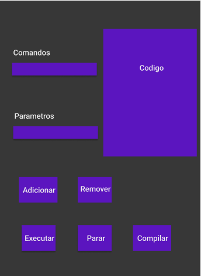
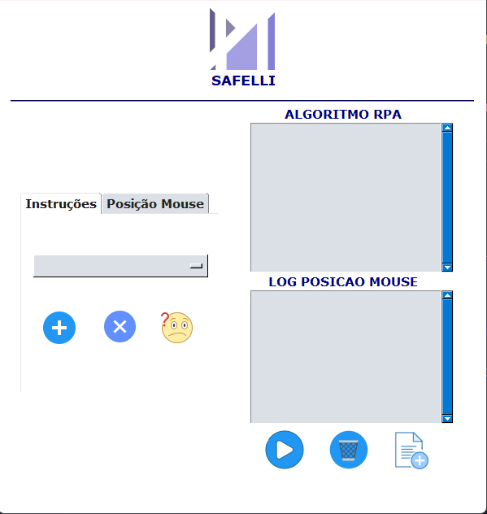
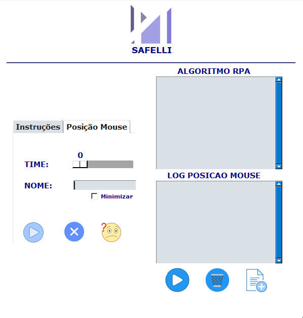

# Projeto Python

<!---Esses são exemplos. Veja https://shields.io para outras pessoas ou para personalizar este conjunto de escudos. Você pode querer incluir dependências, status do projeto e informações de licença aqui--->

> Estou desenvolvendo uma ferramenta ao qual qualquer pessoa consegue criar uma simples automacao.

### Progresso

 Nesse primeiro dia pensei na Interface e na estrutura do projeto..

> Desenho da interface

> Versao Recente da Interface

